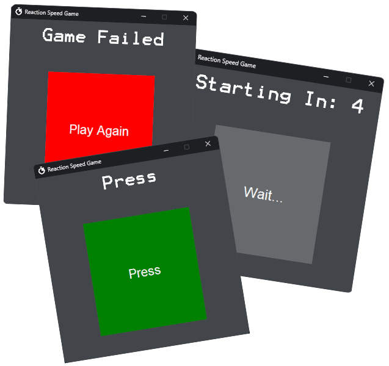

# Reaction Speed Game
A simple reaction speed game programmed in python using the tkinter graphics library.

## Functionality
- Compact Intuitive Interface [Dark Mode]
- Reaction Times Displayed In Milliseconds
- High Score Support

## Requirements
- **Python 3.0** ↳ Python Packages: time, random, threading, ctypes & tkinter
- **Windows 11** - Required For Dark Title Bar [Optional]

## Credits
<a href="https://github.com/Techeryy">Programmed By Stephen Adams - Techeryy</a>

<a href="https://www.flaticon.com/free-icons/stopwatch">Application Favicon By fjstudio - Flaticon</a>